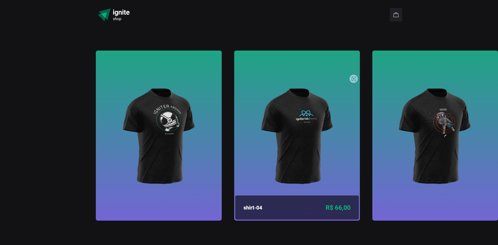
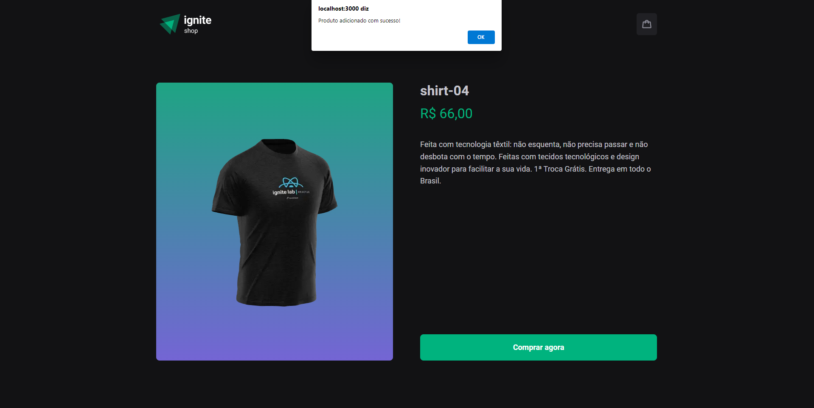
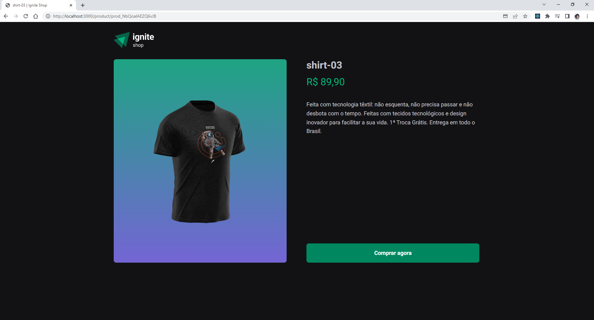
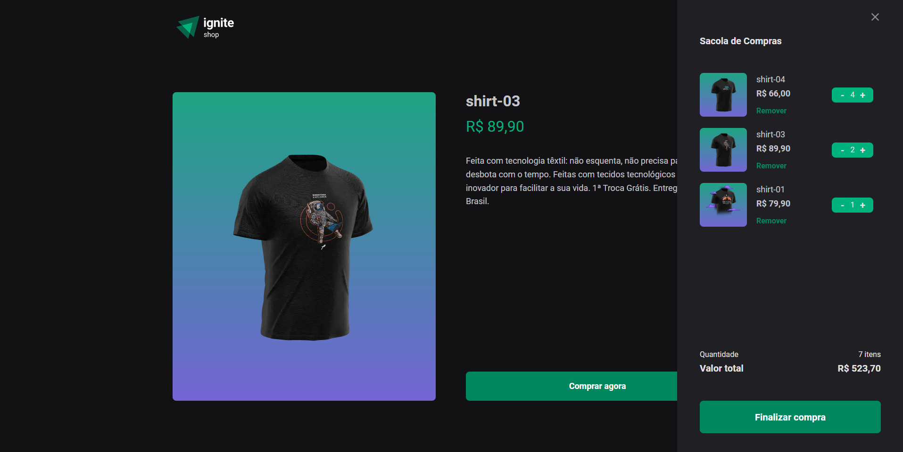
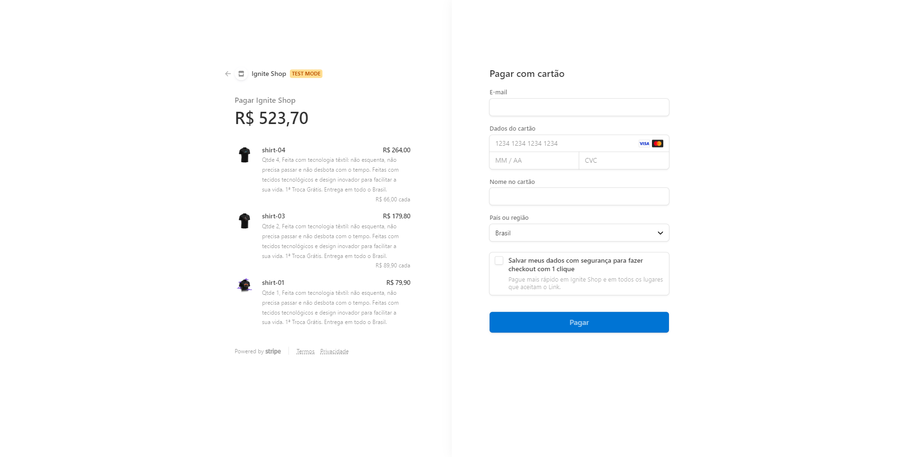
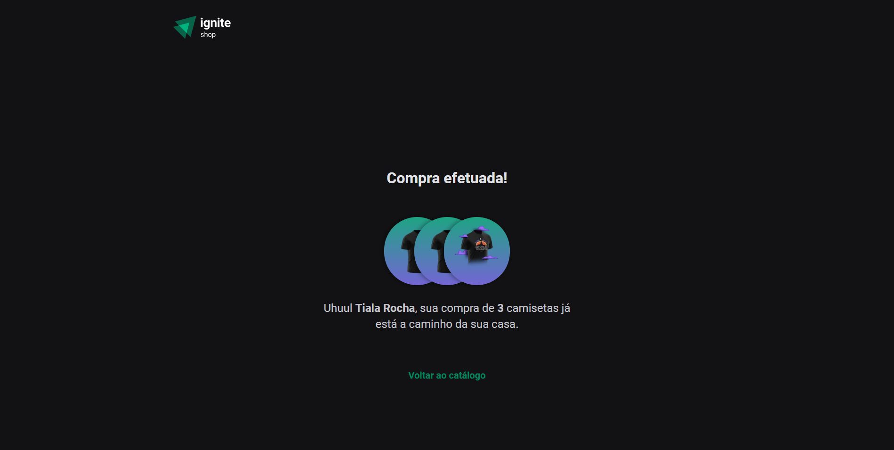

## Ignite Shop Challenge Adding Cart Shop

First, run the development server:

```bash
npm run buil
# or
yarn buil
# then
npm start
# or
yarn start
```

### Ignite Rocketseat Challenge 04 - Next.js fundamentals

Application developed to study the creation of a complete project with the Next.js framework. Using StitchesJS, going through SPA's, server-side rendering (SSR) and static-site generation (SSG) concepts.
  In addition, it was studied and implemented in the project:
- Shopping cart hook
- Routes in the application
- Configuring Stitches for styling
- Images in Next.js
- Stripe account setup
- Consumption of data registered in Stripe
- Data Fetching in Next.js
- SSA and SSG
- Browsing via Link
- SSG with dynamic parameter
- SSG fallback
- Link prefetch
- API routes in Next.js
- Redirect in SSR
- SEO

In addition, in this challenge, I took advantage of the application: ... that I had already developed on the trail to implement a cart that uses data from the Stripe API to search for existing items, and controls, through the application, the number of items that the person wants to buy.
In this challenge:
- I used a list already created by the application, but adding the possibility of adding items to the cart on each product page.
- I stored all items selected in the application, displaying their quantity and price in the cart.

### Video:
 
</br>
### Images:


 



 



 

